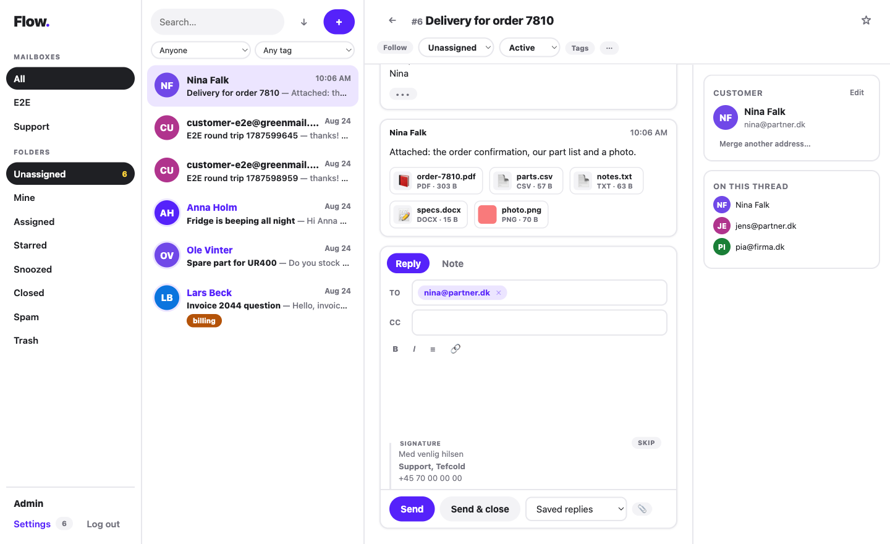

<p align="center">
  <picture>
    <source media="(prefers-color-scheme: dark)" srcset="docs/assets/logo-dark.svg">
    
  </picture>
</p>

<p align="center">
  A small, self-hosted, <strong>email-first shared inbox</strong> for teams.<br>
  IMAP in, SMTP out, a fast web UI, an HTTP API, webhooks, MCP, and plugins — all in core, all MIT.

  **Deploy in one command:** `docker compose up -d` — see [docs/OPERATIONS.md](docs/OPERATIONS.md).
</p>

<p align="center">
  <a href="https://github.com/andershfranzen/flow/actions/workflows/ci.yml"></a>
  <a href="LICENSE"></a>
  
  
  
</p>

---

<p align="center">
  
</p>

Your team shares `support@example.com`. Flow turns that mailbox into
conversations you can assign, tag, note, search, and reply to together —
without the mail ever leaving your mailbox, and without a per-seat fee.

Flow is an **overlay**: it fetches over IMAP and replies through the same
account's SMTP. Your mailbox stays the source of truth. Leaving Flow never
requires an export ritual, because the mail was always yours.

## Why Flow exists

| Project | License reality | Shape |
|---|---|---|
| FreeScout | AGPL-3.0 + paid modules | Light, email-first |
| Chatwoot | MIT core, proprietary `enterprise/` | Heavy, omnichannel, open-core |
| Zammad | AGPL | Full ITSM |
| **Flow** | **MIT on every file** | **Light, email-first, scriptable** |

The gap Flow fills: **light + OSI-permissive on the whole tree + not
open-core + scriptable**. There is no module shop, no `.ee.` directory, no
license key, and no CLA assigning copyright to a company. The features other
help desks sell — saved replies, API access, webhooks, extra security — are
ordinary core code here. This is a commons project, not a SaaS pitch.

## Features

**The inbox**
- Conversations with global numbers (`#142`), statuses (active / pending /
  closed / spam / trash), folders (Unassigned, Mine, Assigned, Starred, …)
- Assign, tag, star, follow, merge, move between mailboxes, forward
- **Teams** with round-robin auto-assignment (via workflows), per-agent
  signatures, editable customer profiles with merge and history
- Internal notes with `@name` mentions, visually distinct from mail
- Collision detection ("Ada is viewing") and live list updates over SSE
- Rich-text replies with inline image paste, drafts that autosave, saved
  replies with `{{customer.name}}`-style variables, mail-client **recipient
  chips** (Backspace turns a badge back into editable text), a live
  signature preview with per-mail toggle, and **undo send** (15s window)
- **Attachment cards with in-app preview** — images, PDF, audio, video and
  text render in an overlay; everything else downloads safely
- Reply-all defaults from the whole thread; a participants panel shows
  everyone on it; quoted history and signatures collapse behind `•••`
- Full-text search (SQLite FTS5), keyboard shortcuts (`j`/`k`/`e`/`r`)
- **Per-agent unread state** (bold rows), **snooze** ("until Monday 09:00",
  woken early by customer replies), **bulk actions** (close / assign / tag
  many at once), oldest-first queue mode, and assignee/tag filters
- Animated throughout — subtle, fast, and **disableable per agent**, with
  the OS reduced-motion preference respected automatically
- **Workflows** — a visual, drag-and-drop automation builder (trigger →
  conditions → actions): auto-tag, auto-assign (incl. team round-robin),
  auto-reply, forward, move, close, prioritised rules per mailbox or global
- **Reports** (per-day chart, per-agent and per-mailbox tables, avg
  first-reply time) and **TOTP two-factor auth** with QR setup

**The pipeline**
- IMAP polling plus optional IMAP IDLE for instant fetch
- Password auth or **OAuth for Microsoft 365 and Gmail** (XOAUTH2 on both
  IMAP and SMTP; tokens encrypted at rest, refreshed automatically)
- Proper threading (`References`/`In-Reply-To` + subject fallback), dedup,
  bounce detection, loop and flood guards, auto-submitted mail filtering
- Hostile-HTML sanitizer, plain-text extraction, charset normalization
- Queued SMTP sending with retries — never on the HTTP request
- Optional loop-safe auto-reply; signatures per mailbox and per agent
  (rich HTML with logos, live preview in the composer, one-click skip) —
  or managed entirely by your provider (see below)

**For builders**
- **If the UI can do it, the API can do it** — REST with token auth and
  read/write scopes
- Signed webhooks on inbound/outbound mail, assignment, and status changes
- An **agent-native MCP server** at `/mcp` — 25 tools covering the whole product,
  from triage (`search`, `get_thread`, `draft_reply`, `send`,
  `list_mailboxes`, `assign`) — bring your own model; core never calls an LLM
- **In-process plugins, managed in the UI** (Settings → Plugins): install
  from a git URL, enable/disable instantly, update, uninstall — with full
  access to models, events, MCP tools, routes, and embeddable settings
  pages. See [docs/EXTENDING.md](docs/EXTENDING.md)

**Boring on purpose**
- Rails 8 + SQLite + Solid Queue by default — one volume, nightly consistent
  backups built in, runs on a $5 VPS. **PostgreSQL supported** via a single
  `DATABASE_URL` when you want it; the test suite runs against both in CI.
- Hardened: strict CSP, rolling session expiry, rate limits, SSRF-guarded
  webhooks, size caps, timeouts on every mail connection.
  See [docs/OPERATIONS.md](docs/OPERATIONS.md).

## Install

```sh
git clone https://github.com/andershfranzen/flow.git && cd flow
export SECRET_KEY_BASE=$(openssl rand -hex 64)   # keep it safe — it also encrypts mailbox credentials
export FLOW_HEALTH_TOKEN=$(openssl rand -hex 32) # bearer token for detailed monitoring
export APP_URL=https://inbox.example.com          # behind your TLS reverse proxy
docker compose up -d --build
docker compose exec web bin/create-admin you@example.com "Your Name"
```

Log in, go to **Settings → Mailboxes**, and connect your shared mailbox:

- **Ordinary IMAP** (Fastmail, cPanel, …): paste host + credentials, press
  **Test connection**.
- **Gmail**: an app password works today, or use OAuth below.
- **Microsoft 365**: requires OAuth (Microsoft disabled password IMAP):
  1. Register an Entra ID app — delegated `IMAP.AccessAsUser.All`,
     `SMTP.Send`, `offline_access`; redirect URI
     `https://your-flow/oauth/callback`.
  2. Paste client id/secret under **Settings → Organisation**.
  3. Set the mailbox's authentication to Microsoft 365 and press **Connect**.

New mail appears within ~30 seconds (or instantly with the optional `idle`
container, included in the Compose file).

**Backup** = copy the `flow_storage` volume. Restore = put it back.

**TLS** is assumed at your reverse proxy (Caddy, nginx, Traefik); Flow sets
secure cookies and expects `X-Forwarded-Proto`.

## Signatures

Three models, pick per company:

1. **Per mailbox** (Settings → Mailbox): the shared signature, rich HTML with
   logos supported. Appended server-side on every send.
2. **Per agent** (My profile): overrides the mailbox signature for that
   agent's replies. The composer shows a live preview of what will be
   appended, with a one-click toggle to skip it on a given mail.
3. **Provider-managed**: if your organisation stamps signatures centrally —
   Microsoft 365 transport rules, Exclaimer, CodeTwo, and the like — those
   apply at the mail server *after* Flow submits over SMTP, so they work
   with Flow automatically. Just leave Flow's signature fields empty to
   avoid doubled signatures.

What no overlay tool can do is *read* an agent's personal Outlook signature —
that lives in the Outlook client and is only reachable via the Graph API, and
models 1–3 cover the company need without it.

## CLI

```sh
docker compose exec web bin/create-admin EMAIL NAME   # add an admin
docker compose exec web bin/fetch-now                 # fetch immediately
docker compose exec web bin/send-test MAILBOX TO      # verify SMTP
```

`GET /health` reports the database and last successful fetch per mailbox. It
requires `Authorization: Bearer $FLOW_HEALTH_TOKEN`; use `/up` for an
unauthenticated container liveness check.

## API, webhooks, MCP, plugins

```sh
# Settings → API tokens, then:
curl -H "Authorization: Bearer si_..." https://inbox.example.com/api/conversations
```

Webhooks POST signed JSON (`X-Inbox-Signature`, HMAC-SHA256) on
`thread.created`, `message.inbound`, `message.outbound`, `thread.assigned`,
`thread.status`. MCP is disabled by default; explicitly enable it in
Settings → Organisation before pointing a client at `POST /mcp`. Start with a
read-scope token, treat inbound customer content as untrusted instructions,
and use draft-first plus human review before any write or send tool.
For in-process plugins and a hello-world bot that needs no PR to core, read
[docs/EXTENDING.md](docs/EXTENDING.md).

## Development

```sh
bin/setup          # First run: PostgreSQL (or SQLite fallback), dependencies, database, seed data
bin/dev            # Daily use: Rails + jobs + Vite; open http://localhost:5173
bin/setup --reset  # Reset the development database when needed
```

Sign in with the seeded `admin@flow.local` / `flowdev123` (development only).
`bin/setup` finds a local PostgreSQL server, or starts the Compose dev-profile
container when Docker is around; set `DATABASE_URL` beforehand to use another
instance. Machine-specific seed overlays (real mailboxes, company plugins)
go in the untracked `db/seeds.local.rb`.
`bin/dev` runs the three processes from `Procfile.dev` — Rails API on 3111
(the Vite proxy expects it), the Solid Queue worker, and Vite with HMR on
5173 — so work against 5173.

```sh
bin/rails test        # the whole backend suite; CI runs it on SQLite and PostgreSQL
bin/e2e-greenmail     # live IMAP/SMTP round trip (needs Docker)
```

The stack is deliberately frozen: Rails 8 API + Active Record + SQLite +
Solid Queue, Vue 3 + Vite + Pinia SPA served by Rails in production.
Read [PLAN.md](PLAN.md) for every decision and why.

## Operations

Backups, monitoring/alerting, PostgreSQL, upgrades, retention, and the
security posture are documented in [docs/OPERATIONS.md](docs/OPERATIONS.md).

## Honesty section

Known threading, charset, and operational limitations are listed in
[docs/KNOWN-ISSUES.md](docs/KNOWN-ISSUES.md) — not hidden. The OAuth flows
are tested against stubbed endpoints; real-tenant reports welcome.

## License

[MIT](LICENSE) on every file in the tree. Contributions land under the same
license. Sustainability is a core small enough that one person can keep it —
not a second license.
